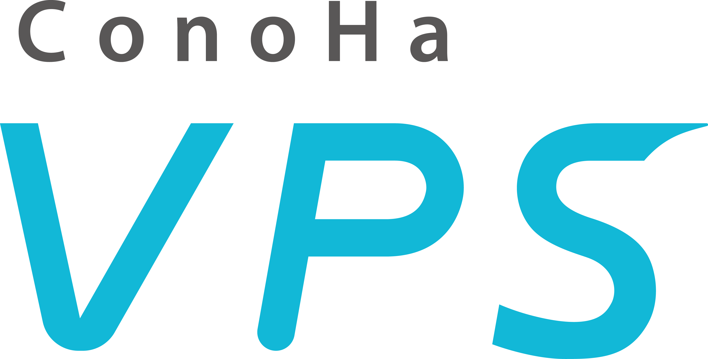

<div align="center">
  
</div>

# Terraform ConoHa VPS Provider

> [!NOTE]
> これは [gmo-internet/terraform-provider-conohavps](https://github.com/gmo-internet/terraform-provider-conohavps) を Aid-On が fork し、ConoHa VPS（Ver.3.0）の公開 API が提供する範囲のリソースとデータソースを追加したものです（Apache License 2.0）。追加分は GMO インターネット株式会社の公式提供ではありません。変更点は [CHANGELOG.md](CHANGELOG.md) を参照してください。

- Terraform ウェブサイト: https://developer.hashicorp.com/terraform
- ドキュメント: https://registry.terraform.io/providers/gmo-internet/conohavps/latest/docs

Terraform ConoHa VPS Provider は、Terraform が [ConoHa VPS](https://vps.conoha.jp/) 上のリソースを管理できるようにするプラグインです。

現在、下記リソースの管理に対応しています（★ はこの fork で追加したもの）。

| 分類 | リソース | データソース |
| --- | --- | --- |
| サーバー | サーバー、SSHキーペア、★ポートの接続、★自動バックアップ | ★フレーバー（プラン）、★イメージ |
| ボリューム | ボリューム、★ボリュームの接続、★スナップショット | ★バックアップ一覧 |
| ネットワーク | セキュリティグループ、セキュリティグループルール、★ローカルネットワーク、★サブネット、★ポート、★追加IP | ★QoS ポリシー |
| ロードバランサー | ★ロードバランサー、★リスナー、★プール、★メンバー、★ヘルスモニター | |
| DNS | ★ドメイン、★レコード | ★ドメイン |
| オブジェクトストレージ | ★コンテナ、★容量 | |
| イメージ | ★イメージ保存容量 | ★イメージ保存の使用量 |
| アイデンティティ | ★ロール、★サブユーザー、★S3 互換のアクセスキー | ★パーミッション一覧 |

追加分は、公開 API のドキュメントに沿って実装し、偽の API に対するテストで確認しています。実際の API での確認は順次行います。

詳細については、ドキュメントを参照してください。

> [!IMPORTANT]
> Terraform ConoHa VPS Provider は、APIユーザーの認証情報を使用します。APIユーザーの作成については、[APIユーザーを作成する](https://doc.conoha.jp/reference/api-vps3/api-cp-vps3/cp-create_api_user-v3/) を参照してください。

> [!WARNING]
>  本ソフトウェアは現在ベータ版です。機能や動作が予告なく変更される場合があります。本番環境での使用前には十分なテストを行ってください。このベータ版 Terraform ConoHa VPS Provider を使用することで、これらの条件に同意したものとみなされます。

## 使用例

ドキュメントを参照してください。

この fork は Terraform Registry に公開していないため、手元でビルドして `dev_overrides` で使います。

```sh
go install .
cat >> ~/.terraformrc <<'X'
provider_installation {
  dev_overrides {
    "registry.terraform.io/gmo-internet/conohavps" = "/Users/<you>/go/bin"
  }
  direct {}
}
X
```

フレーバーとイメージの ID は、データソース（`conohavps_flavor`、`conohavps_image`）で名前から引けます。

## 要件

- [Terraform](https://developer.hashicorp.com/terraform/install) >= 1.0
- [Go](https://go.dev/doc/install) >= 1.24

## 開発

### ビルド

ビルドには Go のインストールが必要になります。

Go のインストールが確認できたら、`make build` を実行します。

```
$ make build
```
### テスト

下記の環境変数の設定が必要です。各変数の詳細については、ドキュメントを参照してください。

- `CONOHAVPS_USER_ID`
- `CONOHAVPS_PASSWORD`
- `CONOHAVPS_TENANT_ID`
- `CONOHAVPS_REGION`
- `CONOHAVPS_IDENTITY_ENDPOINT`

環境変数が設定できたら、`make testacc` を実行します。

```
$ make testacc
```

> [!CAUTION]
> テストでは、ConoHa VPS 上に実際にリソースを作成するので、料金が発生することに注意してください。

## コントリビュート

- [コントリビューションガイド](./CONTRIBUTING.md)
- [行動規範](./CODE_OF_CONDUCT.md)
- [セキュリティポリシー](./SECURITY.md)

## ライセンス

このプロジェクトは [Apache License 2.0](LICENSE) の下で公開されています。